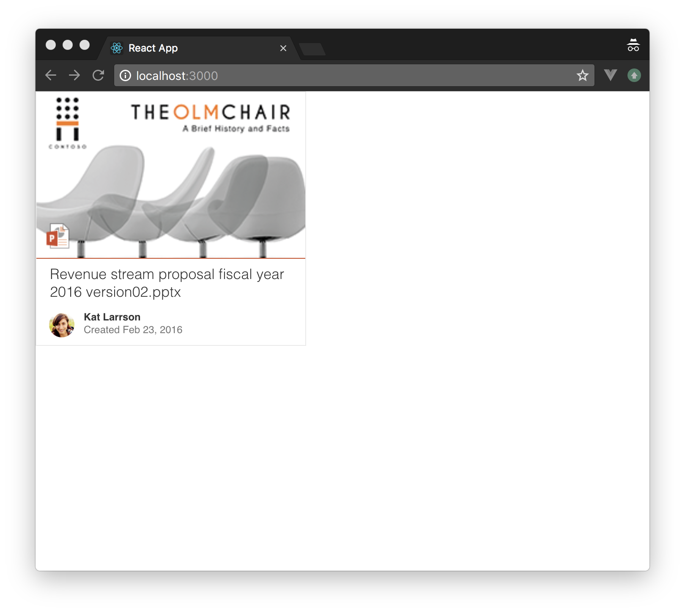
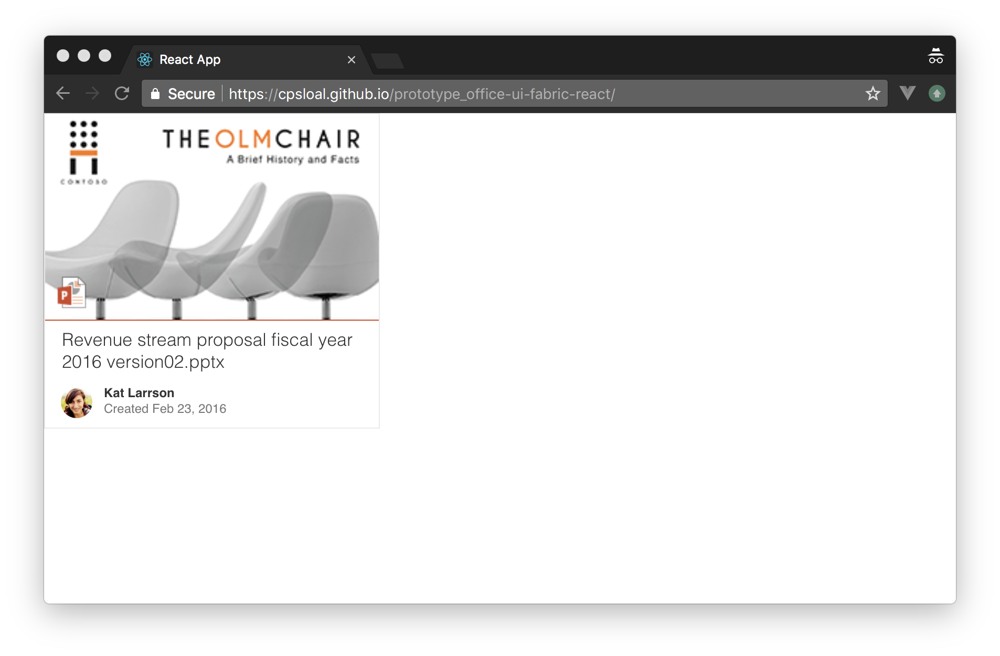
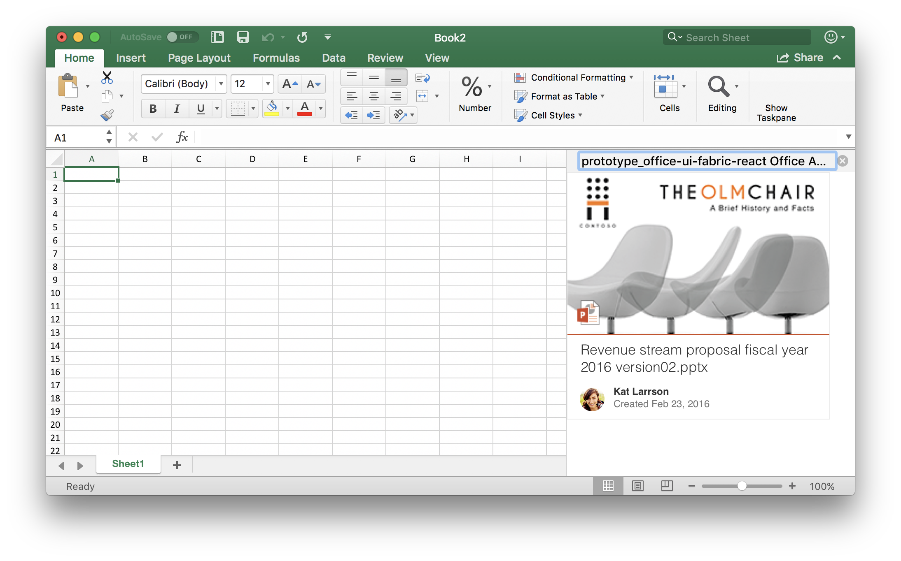
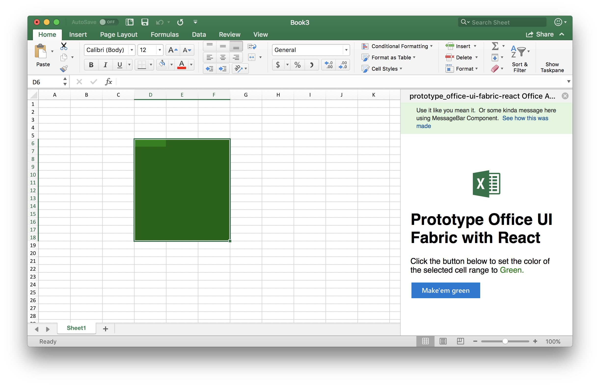
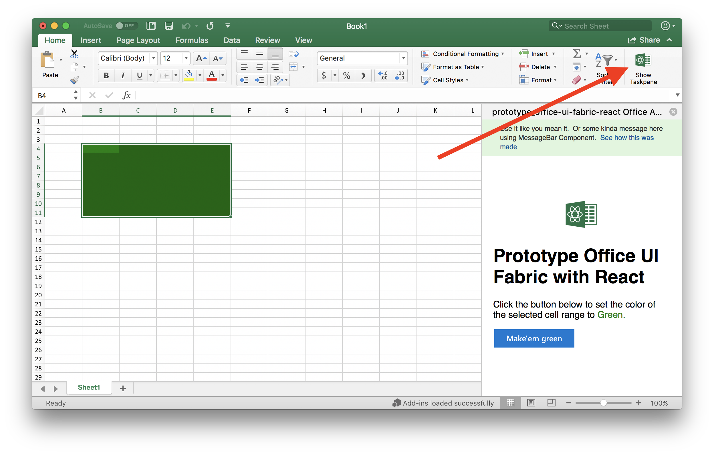

<div align="center">
  <br>
  
  <br>
  <br>
</div>

<h1 align="center">prototype_office-ui-fabric-react</h1>


<div align="center">

[](https://forthebadge.com)

[](https://forthebadge.com) [](https://forthebadge.com) [](https://forthebadge.com)
</div>

## Overview
A React App prototype using Office UI Fabric components.  Just to get familiar with Office UI Fabric components. 

The End Goal is to be able to create Office Add-ins.

> If you like raw, unrefined sugar, check out the __Long Form Recipe__ for what seems like step-by-step thought process and the birth of this prototype.

## Build Setup

``` bash
# install dependencies
npm install

# serve the app from localhost:3000
npm start

# build application for production
npm run build

# run unit & end-to-end tests
npm test


```

Well, thats it folks.  We are done!  We can all go home now.

## Long Form Recipe

> This section contains step by step of how this prototype came to be (as its being built).  If a blog is written, then the link would be here and contain a more user-friendly documentation and descriptions.


### Chef's Choice (お任せ)
  1. [create-react-app](https://www.npmjs.com/package/create-react-app)
  1. [office-ui-fabric-react](https://github.com/OfficeDev/office-ui-fabric-react)
  1. [generator-office](https://github.com/OfficeDev/generator-office)


### In the beginning ...
Starting with ...

https://github.com/OfficeDev/office-ui-fabric-react/blob/master/ghdocs/OnBoarding/SampleApp.md


It is presumed that **NodeJS** is installed already.  Then from command prompt:

```
# Install tool needed to generate a react app scaffolding
npm install -g create-react-app

# Create a scaffolded React App
create-react-app prototype_office-ui-fabric-react

```

Following are the settings used when generating the project scaffolding:

>**Readme generated by create-react-app is [here](README.from.create.react.app.md)** 
> 
<br>

Then ...
```
# Install Office UI Fabric
cd prototype_office-ui-fabric-react
npm install office-ui-fabric-react --save

```


### Add DocumentCardBasic component
Following the instrunctions [here](https://github.com/OfficeDev/office-ui-fabric-react/blob/master/ghdocs/OnBoarding/SampleApp.md
) we now have the following:



 __[[see code changes](https://github.com/cpsloal/prototype_office-ui-fabric-react/commit/e6db78b4ff39de2d58c7c869b775906f8d9ade13)]__


<br>

### Host this app already...
We need to serve this page somehwere! Going to follow the docs/recommendations [here](https://github.com/facebook/create-react-app/blob/master/packages/react-scripts/template/README.md#deployment) and going to try [GitHub Pages](https://github.com/facebook/create-react-app/blob/master/packages/react-scripts/template/README.md#github-pages)


```
# Install tool needed to generate and publish to GitHub Pages
yarn add --dev gh-pages

# Update packages.json with deploy script command:
# "deploy": "gh-pages -d build"

# Now deploy the app to GitHub Pages
yarn run deploy

```

Yeeeeepy! deployed to GitHub Pages (see the URL woooo!)



__[[see code changes](https://github.com/cpsloal/prototype_office-ui-fabric-react/commit/f5a3f33478521ecc79c402099259e7a183b7c138)]__


<br>

### Now ... Office Add-ins? Really?

https://docs.microsoft.com/en-us/office/dev/add-ins/overview/office-add-ins

https://docs.microsoft.com/en-us/office/dev/add-ins/quickstarts/excel-quickstart-jquery?tabs=visual-studio-code

hmm... looks like Office has Yeoman generators to create a Office Add-ins!

```
# Install Yeoman and the Office Add-ins generator
npm install -g yo generator-office

# Now scaffold the project :-(
yo office

```

Following is what I went through.  The choices made for Yeoman generator!

```


     _-----_     ╭──────────────────────────╮
    |       |    │   Welcome to the Office  │
    |--(o)--|    │   Add-in generator, by   │
   `---------´   │ @OfficeDev! Let's create │
    ( _´U`_ )    │    a project together!   │
    /___A___\   /╰──────────────────────────╯
     |  ~  |     
   __'.___.'__   
 ´   `  |° ´ Y ` 

? Would you like to create a new subfolder for your project? No
? What do you want to name your add-in? prototype_office-ui-fabric-react Office Add-in
? Which Office client application would you like to support? Excel
? Would you like to create a new add-in? No, I already have a web app and only need a manifest file for my add-in.

For more information and resources on your next steps, we have created a resource.html file in your project.
? Would you like to open it now while we finish creating your project? Yes
----------------------------------------------------------------------------------

      Creating manifest for prototype_office-ui-fabric-react Office Add-in add-in

----------------------------------------------------------------------------------


 conflict package.json
? Overwrite package.json? overwrite this and all others
```

So turns out that running yeoman in an existing project is messy, removed whole bunch of stuff!  Most likely not going to work.  But lets try it aye!

The generated code is checkin (minus the package.json because its definitely messedup) [Code changes are here.](https://github.com/cpsloal/prototype_office-ui-fabric-react/commit/50eda720007c720044e82d8b16fae2b914cc3e72)

[Here are the changes](https://github.com/cpsloal/prototype_office-ui-fabric-react/commit/5fb1e203164a83fe42fbdbeb91c381fba896708b) added for the Office Add-in stuff in packages.json.  The Office Add-in Generator should have modified existing package.json correctly or said what needed to be changed!

Move Office Add-in generated files to fit the React App structure.  [Here are the changes](https://github.com/cpsloal/prototype_office-ui-fabric-react/commit/d9f4a0f0a9dd0cb5cd7135728e9ce48b3abb5638)

[Remove the resource.html](https://github.com/cpsloal/prototype_office-ui-fabric-react/commit/b9bcc8ef49b970d89d0ef74d1d2e43e9134ef26c) generated help file by Office Add-in generator that were a bit wrong when trying to side-load the add-in on Office for Mac.  Instead follow instructions [here](https://docs.microsoft.com/en-us/office/dev/add-ins/testing/sideload-an-office-add-in-on-ipad-and-mac#sideload-an-add-in-on-office-for-mac) to side-load an Office Add-in on Office for Mac.

Now [update Office Add-in manifest file](https://github.com/cpsloal/prototype_office-ui-fabric-react/commit/ec70ab0b83e06fc5ad3f07677fddb42897d79d26) and deploy.

Yes!!! now we are talking ...



Great 8( found a better doc! [Here it is](https://docs.microsoft.com/en-us/office/dev/add-ins/quickstarts/excel-quickstart-react) ... and its better than the fragmented documentation from folks at a big company.


<br>

### Make the Excel Add-in do something 'interesting'
Using the instructions [here](https://docs.microsoft.com/en-us/office/dev/add-ins/quickstarts/excel-quickstart-react) got the Excel Add-in to work, and the [code changes are here](https://github.com/cpsloal/prototype_office-ui-fabric-react/commit/fbe93c35ea76fad88e21be5282c1c979070ac6b3) and the result:




### The icons for the Office Ribbon ...
The icon was missing in the Office Ribbon to show the TaskPane.  Just need to [add the relevant icons](https://github.com/cpsloal/prototype_office-ui-fabric-react/commit/7d00cee60cf968ef949c0957cc1e2edeaefcba40) and voila:


